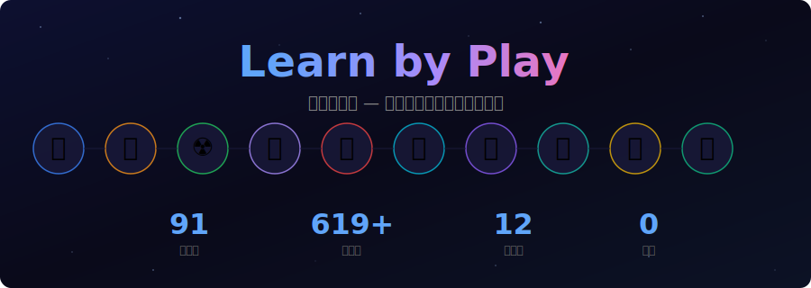

  

  <a href="https://edge-claw.github.io/learn-by-play/">🎮 在线体验</a> ·
  <a href="#游戏列表">📋 游戏列表</a> ·
  <a href="CONTRIBUTING.md">🤝 参与贡献</a>

  
  
  
  

---

## 游戏列表

| 领域 | 游戏 | 关卡 |
|------|------|------|
| 计算机与AI | 芯片内部可视化 · 边缘AI部署 · 神经网络构建 · 密码学与安全 | 交互/5/7/7关 |
| 区块链 | 比特币原理 · 以太坊原理 | 6/6关 |
| 物理学 | 火箭物理 · 核物理 · 量子计算 · 超导体 · 粒子加速器 · 激光物理 · 闪电与等离子体 | 6/7/7/7/7/7/7关 |
| 生物与医学 | CRISPR基因编辑 · 免疫系统大战 · 蛋白质折叠 · 纳米机器人 | 7/7/7/7关 |
| 太空探索 | 黑洞物理 · 太阳系建造者 · 空间站工程 | 7/7/7关 |
| 工程技术 | 半导体制造 · 3D打印 · 电池与储能 · 全息投影 | 7/7/7/7关 |
| 地球与环境 | 气候系统模拟 · 海洋深潜探索 | 7/7关 |

共 **28 个游戏**，**150+ 个关卡**，覆盖 **7 大领域**。

## 特点

- **零依赖** — 纯 HTML + Canvas 2D，无需安装任何东西
- **单文件** — 每个游戏一个 `.html` 文件，双击打开即玩
- **循序渐进** — 每个游戏 6-7 关，从基础概念到高级应用
- **交互式学习** — 不是看视频，是亲手操作、实验、探索

## 贡献

欢迎提交新游戏！详见 [CONTRIBUTING.md](CONTRIBUTING.md)。

## License

[MIT](LICENSE)
